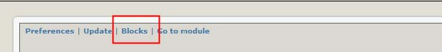

# Blocks

There is one block available, “Partners”, which displays a list of partner logos. A number of configuration options are available for this block, which can be set through Admin -&gt; System -&gt; Blocks -&gt; Partners -&gt; Edit, or by clicking on the Blacks link in the Admin:

And then clicking on the “Edit” icon :

The main custom options for the XOOPS Partners block are:

