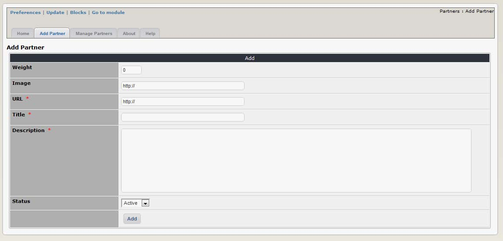
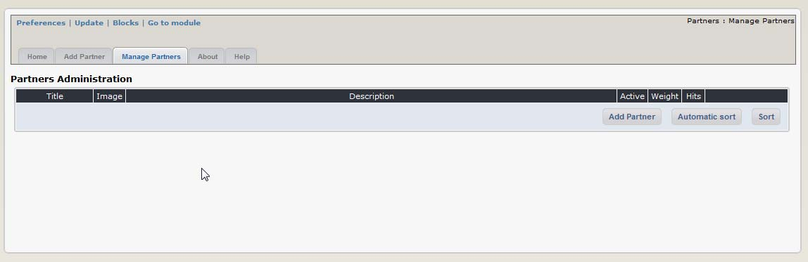
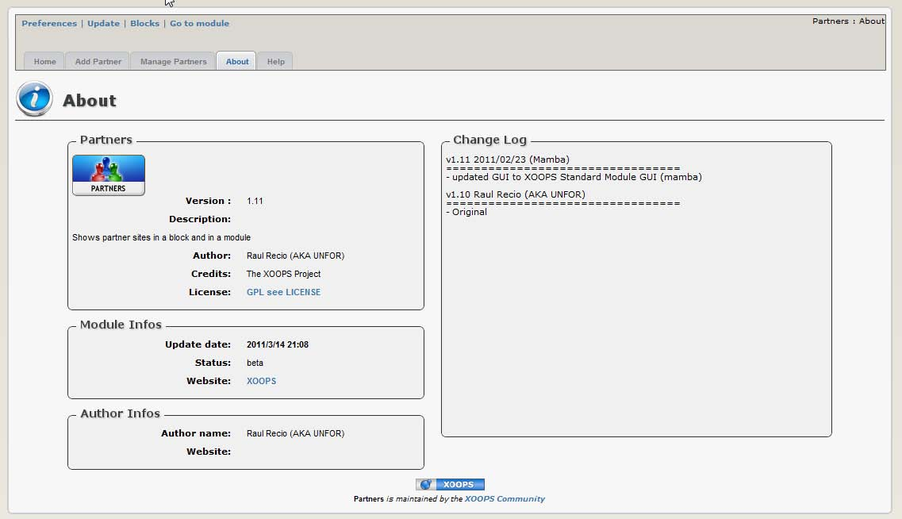
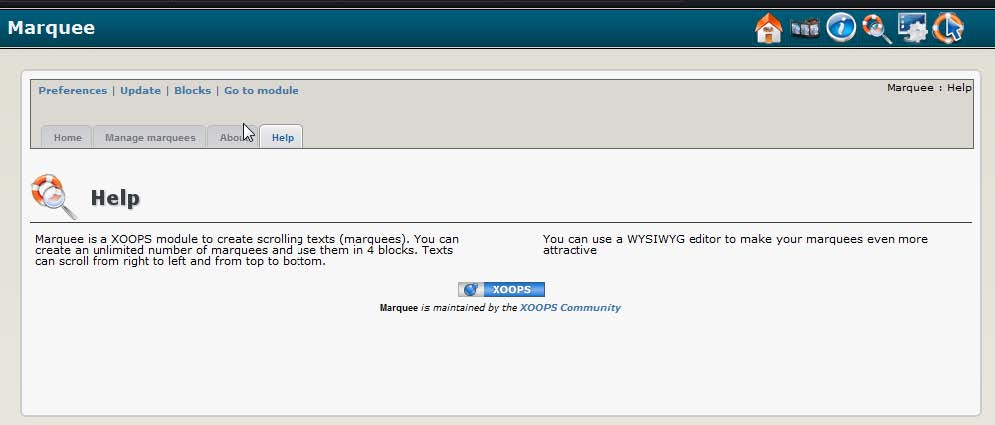

# 2.0 Administration Menu

There are for options on top:

|Option|	Action|
|---|---|
|Preferences|	Here you can configure your preferences for the module|
|Update|	Click here if you’ve made some changes to the module, uploaded new files, etc. – this will recompile the module and update all entries in the database
|Blocks|	When you click here, it will redirect you to the Blocks section of XOOPS, and select the blocks related to your module|
|Go to module|	If the module is visible on the user side, this will take you there

There are five Tabs in the Administration of the XOOPS Partners module: |
-	Home
-	Add Partner
-	Manage Partners
-	About 
-	Home
  
  

**Figure 4 View of the “Add Partner” Tab**

   

**Figure 5 View of the “Manage Partners” Tab**

   

**Figure 6 The “About the Module” Tab**

   

**Figure 7 The “Help” Tab**

