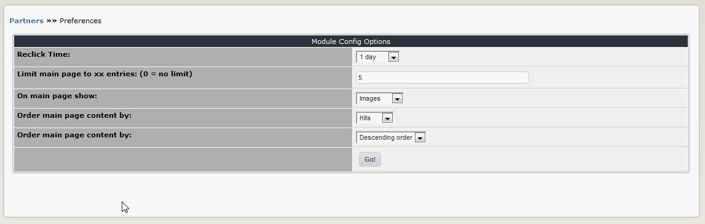

# 3.0 Preferences

In the Preferences, you can set the most important options for the module, such as the number of entries per page.

  

**Figure 8 The Preferences options**

|Option|Function|
|---|---|
|Reclick time:|	This sets the period of time during which repeated clicks on a partner from the same browser will not increment the hit counter (it is based on a cookie). The default is one day.|
|Limit main page to xx entries|	You can control how many partners you want to appear in the Partners index page. The default is five. Set it at ‘0’ to display all available partners (0 = no limit).|
|On main page show|	Choose how you want to display partners on the index page for this module. You have a choice of displaying your partner’s logos, text links to their site, or both.|
|Order main page content by:|	Controls how the Partners index page contents are sorted. The choices are to sort by ID, number of hits, title (alphabetical) or weight. The default is to sort by hits.|
|Order main page content by:|	Ascending or descending order (default is descending).|
