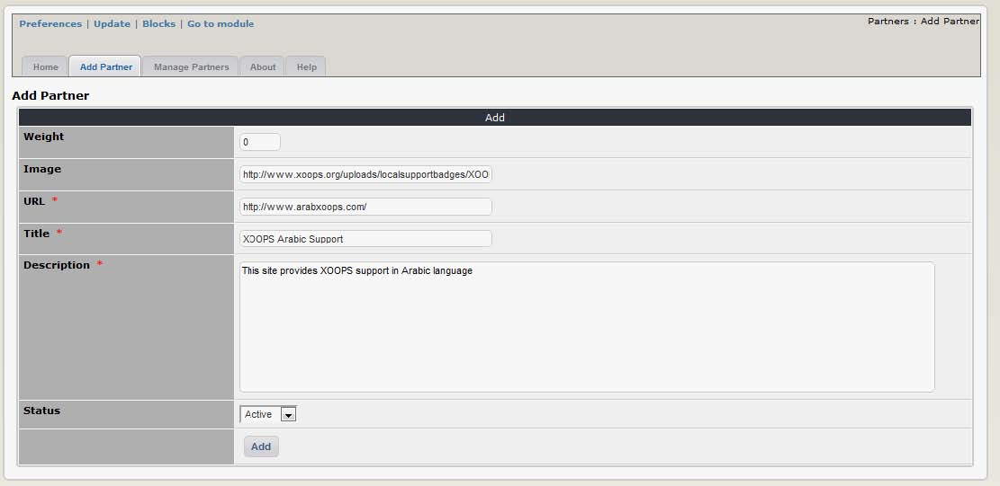

# Operating Instructions

To set up this module you need to: 1. Enter your partner’s details – including a URL for their website and \(optionally\) logo plus a short description \(see ‘Adding a partner’\) 2. Configure your preferences for the module \(see ‘Preferences’\) and optionally the Partners block if you intend to use it \(see ‘Blocks’\) 3. Check that you have given your user groups the necessary module and block access rights to use this module. Group permissions are set through the Administration Menu -&gt; System -&gt; Groups. Detailed instructions on configuring the access rights for user groups are available in the XOOPS Operations Manual.

**Adding a partner**

Selecting ‘Add Partner’ opens a submission form \(shown below\)

where you can enter the details of a new partner. The fields are largely self-explanatory:

| Option | Function |
| --- | --- |
| Weight: | Determines the order in which the partner will be displayed - but only if you set weight as the sort preference for the index page and/or partners block \(these are set independently; see ‘Preferences’ and ‘Blocks’ below\) |
| Image: | Enter the URL for your partner’s logo |
| URL: | Enter the URL for your partner’s website. Note that an error will show if you link to an image that is greater than 110 x 50 pixels. You might need to make your own cut down versions of your partners logos. |
| Title: | The name of your partner |
| Description: | Enter a short paragraph about the partner here. Note that this field has a 255 character limit – if you type anything more it will be cut off ! |
| Status: | This drop down box allows you to toggle the partner on or off. If you set a partner as inactive \(‘no’\) it will not be displayed on the user side. |

Once we click “Add” button, XOOPS will add the Partner to its list: 

Now it’s time to make the Partners visible to the users. This is done by using blocks \(see the section Blocks for more information\). Please click on the “Blocks” link:

You’ll be redirected to the Blocks screen, with the XOOPS Partner block already filtered out for you:

XOOPS Partners Module provides you with only one block. First, let’s move the block to the Right position, and set the block to be visible by clicking on the “visibility” icon, which can have two states:

| Icon | Action |
| --- | --- |
|  | Visible \(on-line\) |
|  | invisible \(off-line\) |

Now that we have it visible, let’s edit it by clicking on the “Edit” icon: 

Now the “Block Edit” screen will open up:

These are the most frequently used custom options that we can change:

| Option | Function |
| --- | --- |
| Put spaces between partners? | This creates a larger gap between partner logos. The default is ‘yes’ and most useful when you are displaying both images and text links in the block. It leaves a gap even if you say ‘no’, but not as big. |
| Fade image? | This option makes the partner logos partially transparent. They become fully visible when the cursor hovers over them. The default is ‘yes’. |
| Randomize partners in blocks? | This randomly determines which partners are shown in the partners block. It does _not_ affect the sort order ! It is only useful if you have more partners than you allow to be shown in the block – the block contents will rotate each time the page is reloaded. Default is ‘yes’. |
| Limit blocks to xx entries | You can control how many partners you want to appear in the block. The default is one. Set it at ‘0’ to display all available partners. |
| In blocks show | You have a choice of displaying partner logos, text links or both. |
| Order block content by | Controls how the block contents are sorted. The choices are to sort by ID, number of hits, title \(alphabetical\) or weight. The default is to sort by hits. |

Most of the time you can leave it as it is. The screenshots below illustrate different configuration options of the Partners block:

| spacing and fading enabled \(the cursor is hovering over the centre partner\) and is showing both images and text links; | images only \(fading and spacing disabled | text links only. |
| --- | --- | --- |
|  |  |  |

Once the block is set correctly and made visible, the Partners can be seen on the User side:

  
**Figure 9 Partners seen live on the your Website in a block**

## Managing partners

This section of the administration menu displays a list of all partners in the database and their details. You can add new partners, edit or delete them from here. The ‘active’ drop down box performs the same function as ‘Status’ \(described ‘Adding partners’ above\). If you change the active status or weight of a partner from this screen you must select ‘sort’ or ‘automatic sort’ to save the revised order. You can also change the active status or weight of a partner via the ‘Edit’ link. ‘Hits’ records the number of times a partner link has been clicked on by a visitor. The ‘automatic sort’ button resets the weighting sequence beginning from 1, while retaining the existing order. For example, the partners shown below are weighted 10, 20, 30. After automatic sorting they would still be listed in the same order but their weight would be shown as 1, 2, 3.

**Figure 10 List of existing Partners**

