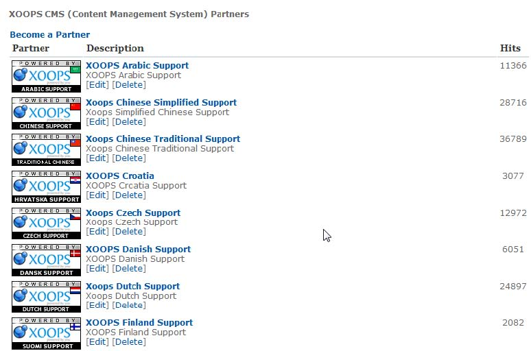
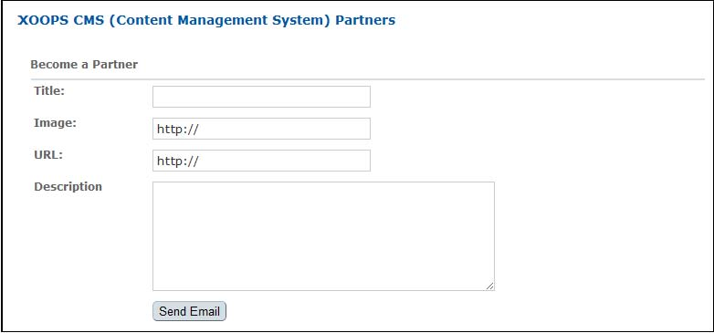

# The User Side

Users can access the list of partner links and logos either through the Partners block or through the Partners index page which is accessible via a link in the main menu. The index page can also show a short description of each site.

The Partners index page also carries two ‘Become a partner’ links. These open a form \(shown below\) that allows users to submit their own website to become a partner: Users can provide a description of their website which will be sent to the site administrator via email \(the recipient will be the site administration email address listed in Admin -&gt; System -&gt; Preferences -&gt; General\).

